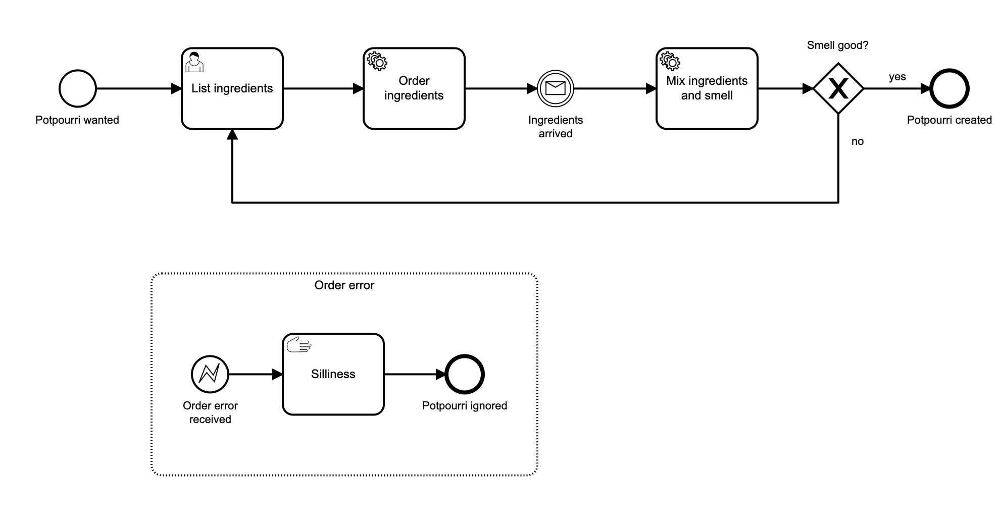

# camunda-cloud-potpourri

[](https://github.com/Camunda-Community-Hub/community/blob/main/extension-lifecycle.md#stable-)

A "learn by doing" project for Camunda Cloud Java development.  

At time of writing, it shows the functionality of the following:
- Service Task implemented by Zeebe Worker
- User Task using a Camunda Form
- FEEL expression variable evaluation after an exclusive gateway
- Message correlation
- Sending BPMN error event to an Event Subprocess

This project utilizes the following libraries:

- Spring Boot Starter.  This project was generated from [start.spring.io](https://start.spring.io/)
- [Spring Zeebe Starter](https://github.com/camunda-community-hub/spring-zeebe) - these handy Spring annotations wrap the [Zeebe Java Client API](https://docs.camunda.io/docs/apis-clients/java-client/index/) nicely.
- Tested with Java 16

## Usage

1. Update the src/main/resources/**application.properties** file with your Camunda Cloud Client API credentials.

```properties
zeebe.client.cloud.cluster-id=your-cluster-id-here
zeebe.client.cloud.client-id=your-client-id-here
zeebe.client.cloud.client-secret=your-secret-here
zeebe.client.cloud.auth-url=https://login.cloud.camunda.io/oauth/token
```

2. Start your local Spring Boot server.  Make sure the JDK version referenced in your pom.xml file is the same version as your JAVA_HOME:

```
mvn spring-boot:run
```
3. Open src/main/resources/potpourri.bpmn in Camunda Modeler to take a look at the process.



4. Start a process instance using the Zeebe Java Client API.  You can execute the "CreateProcessInstance" class directly in your IDE, you can use Java at the command line, or you can use Maven as in the example below.

```
mvn compile exec:java -Dexec.mainClass="io.camunda.getstarted.potpourri.java.CreateProcessInstance"
```

5. Log in to Camunda Cloud.  Select your cluster, and open both Operate and Tasklist.  In Operate, find the newly created instance of the "Perfectly Playful Potpourri Process".  A token should be waiting at the user task.

6. Go to Tasklist and claim the form, then fill it out.  There are hints on the labels to show you how to trigger errors as well as how to have smell good evaluate to false.  Complete the task.

7. To correlate the "Ingredients Arrived" message in your instance, you must first go to Operate, find the properties for the instance, and copy the value of "potpourriId" into the clipboard.  Paste it into the appropriate place in the "SendMessage" class, then execute the class.  You can execute the "SendMessage" class directly in your IDE, you can use Java at the command line, or you can use Maven as in the example below.

```
mvn compile exec:java -Dexec.mainClass="io.camunda.getstarted.potpourri.java.SendMessage"
```

Check Operate to see if the token moved forward.

8. Take a look at the code to see how everything works.  Clone this repo and add to it to continue the Potpourri journey yourself!

